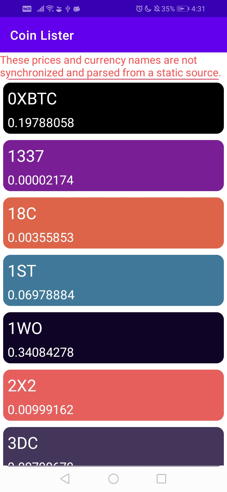

> I wrote this app for my Udemy course and not for practical purposes.

# Coin Lister
Really basic cryptocurrency lister using Retrofit for obtaining the data.

# Screenshots
|  |  |
|------------------------------------------------------------------------|------------------------------------------------------------------------|
