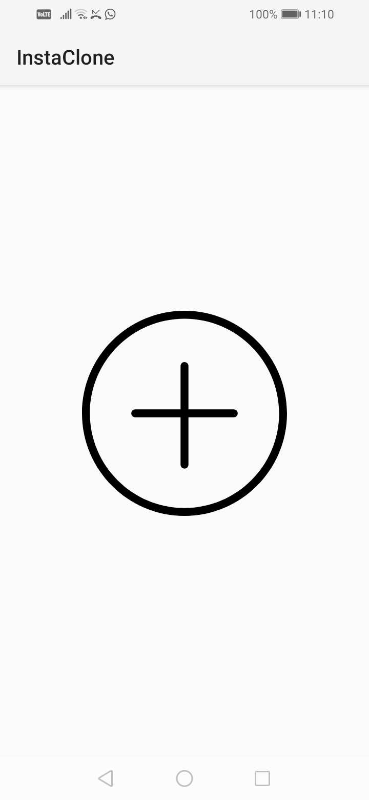
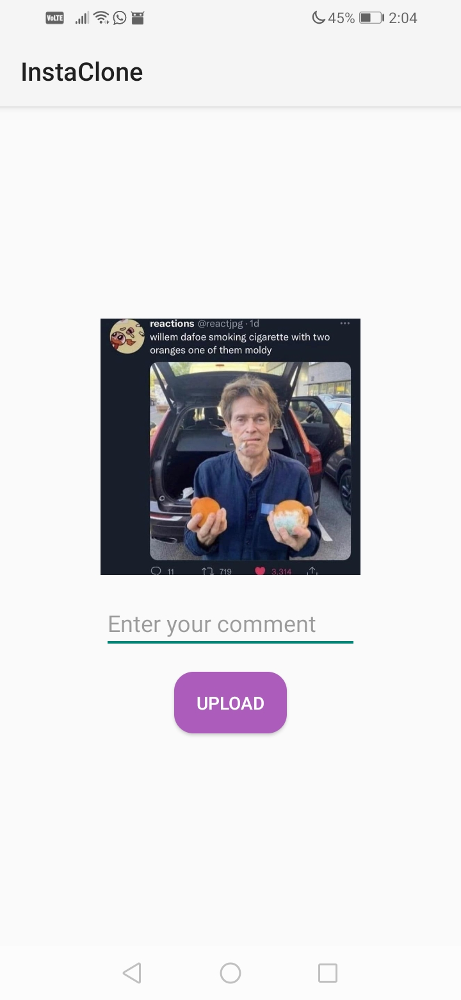

> I wrote this app for my Udemy course and not for practical purposes.

# Instagram Clone
An Instagram clone using Firebase. You can sign up, sign in and share posts. (Wow)

# Screenshots
| login                                                                  | add_post                                                                     | add_post2                                                                      |
|------------------------------------------------------------------------|------------------------------------------------------------------------------|--------------------------------------------------------------------------------|
|  |  |  |

| posts1                                                                   | posts2                                                                   |
|--------------------------------------------------------------------------|--------------------------------------------------------------------------|
|  |  |
